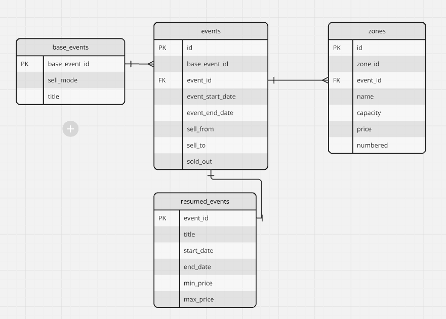

# Fever code challenge

Hello! Glad you are on this step of the process. We would like to see how you are doing while coding and this exercise
tries to be a simplified example of something we do on our daily basis.

At Fever we work to bring experiences to people. We have a marketplace of events from different providers that are
curated and then consumed by multiple applications. We work hard to expand the range of experiences we offer to our customers.
Consequently, we are continuosly looking for new providers with great events to integrate in our platforms. 
In this challenge, you will have to set up a simple integration with one of those providers to offer new events to our users.

Even if this is just a disposable test, imagine when coding that somebody will pick up this code an maintain it on
the future. It will be evolved, adding new features, adapting existent ones, or even removing unnecessary functionalities.
So this should be conceived as a long term project, not just one-off code.

## Evaluation
We will value the solution as a whole, but some points that we must special attention are:
- How the proposed solution matches the given problem.
- Code style.
- Consistency across the codebase.
- Software architecture proposed to solve the problem.
- Documentation about decisions you made.

## Tooling
- Use Python 3 unless something different has been told.
- You can use any library, framework or tool that you think are the best for the job.
- To provide your code, use the master branch of this repository.

## Description
We have an external provider that gives us some events from their company, and we want to integrate them on the Fever
marketplace, in order to do that, we are developing this microservice.

##### External provider service
The provider will have one endpoint:

https://provider.code-challenge.feverup.com/api/events

Where they will give us their list of events on XML. Every time we fetch the events,
the endpoint will give us the current events available on their side. Here we provide some examples of three different
calls to that endpoint on three different consecutive moments.

Response 1
https://gist.githubusercontent.com/sergio-nespral/82879974d30ddbdc47989c34c8b2b5ed/raw/44785ca73a62694583eb3efa0757db3c1e5292b1/response_1.xml

Response 2
https://gist.githubusercontent.com/sergio-nespral/82879974d30ddbdc47989c34c8b2b5ed/raw/44785ca73a62694583eb3efa0757db3c1e5292b1/response_2.xml

Response 3
https://gist.githubusercontent.com/sergio-nespral/82879974d30ddbdc47989c34c8b2b5ed/raw/44785ca73a62694583eb3efa0757db3c1e5292b1/response_3.xml

As you can see, the events that aren't available anymore aren't shown on their API anymore.

##### What we need to develop
Our mission is to develop and expose just one endpoint, and should respect the following Open API spec, with
the formatted and normalized data from the external provider:
https://app.swaggerhub.com/apis-docs/luis-pintado-feverup/backend-test/1.0.0

This endpoint should accept a "starts_at" and "ends_at" param, and return only the events within this time range.
- It should only return the events that were available at some point in the provider's endpoint(the sell mode was online, the rest should be ignored)
- We should be able to request this endpoint and get events from the past (events that came in previous API calls to the provider service since we have the app running) and the future.
- The endpoint should be fast in hundred of ms magnitude order, regardless of the state of other external services. For instance, if the external provider service is down, our search endpoint should still work as usual.

Example: If we deploy our application on 2021-02-01, and we request the events from 2021-02-01 to 2022-07-03, we should
see in our endpoint the events 291, 322 and 1591 with their latest known values. 

## Requirements
- The service should be as resource and time efficient as possible.
- The Open API specification should be respected.
- Use PEP8 guidelines for the formatting
- Add a README file that includes any considerations or important decision you made.
- If able, add a Makefile with a target named `run` that will do everything that is needed to run the application.

## The extra mile
With the mentioned above we can have a pretty solid application. Still we would like to know your opinion, either 
directly coded (if you want to invest the time) or explained on a README file about how to scale this application
to focus on performance. The examples are small for the sake of the test, but imagine that those files contains
thousands of events with hundreds of zones each. Also consider, that this endpoint developed by us, will have peaks
of traffic between 5k/10k request per second.

## Feedback
If you have any questions about the test you can contact us, we will try to reply as soon as possible.

In Fever, we really appreciate your interest and time. We are constantly looking for ways to improve our selection processes,
our code challenges and how we evaluate them. Hence, we would like to ask you to fill the following (very short) form:

https://forms.gle/6NdDApby6p3hHsWp8

# Solution

Below, I explain the decisions made during the implementation of this challenge.

## Technology

I decided to use ASP.NET 8 and C# to implement the solution. I chose these technologies because they are the ones I have used most recently, which accelerated development. ASP.NET 8 has improved its performance and offers a wide range of advanced tools and libraries, facilitating development. Additionally, it is compatible with cloud development and containerization, enabling the application to scale according to demand and adapt easily to different environments.

For the database, I chose PostgreSQL. This management system adheres to the SQL standard, facilitating query portability and data migration. It uses MVCC (Multi-Version Concurrency Control) to handle concurrency, allowing multiple simultaneous transactions with fewer locks, which improves consistency and performance. It also adheres to ACID properties, ensuring data integrity in transactional operations.

I also used Docker to simplify the application's execution. I created a docker-compose file that facilitates the deployment of both the application and the database, allowing the application to run without needing to configure a local environment.

## Implementation

### Architecture

I applied a clean architecture divided into several layers:

- Application:

   - Features: Contains the different modules or use cases of the application.
   
     - Events: Groups the commands, queries, and validators associated with domain events (CQRS).
   
       - Commands: Defines the commands that modify the application's state.

       - Queries: Contains the queries for reading data.

       - Validators:  Validators that ensure requests comply with business rules before execution.

     - Interfaces: Defines the interfaces for repositories and other services implemented in the Infrastructure layer.

 - Domain:

   - Features: Defines the domain-specific logic.

     - Events: Domain entities and events that define the system's behavior and state.

     - GetEvents: Additional logic for retrieving events, including related entities and models.
 
- Infrastructure:

  - BackgroundServices: Background services that execute asynchronous tasks.
  
  - EventsProviders: Components that handle the logic related to events and their updates.
    - Mappers: Maps for converting between domain entities and other data representations.
    - UpdateEvents: Services for updating events, implementing data access logic.
  - Postgres: PostgreSQL database configuration.
    - EntityConfiguration: Specific configuration for database entities.
    - Repositories: Concrete implementations of repositories that handle data access.

- Presentation:

  - Features: Contains the presentation logic.
    - Events: Manages DTOs (Data Transfer Objects) and endpoints for handling HTTP requests.

     - Middlewares: Cross-cutting functionalities that handle aspects like authentication and error handling.
     
I could have organized each layer into separate projects, but I considered that separation into folders within the same project would be clearer.

### Database

According to the requirements, the exercise focuses on two parts: retrieving data from the external provider and searching for stored data.

#### Data Model

Below is the chosen data model schema:

- Base-events: Contains information about the base events, sales mode, and event title.

- Events: Includes specific information for each event, such as start and end dates, sales dates, and a flag indicating whether all seats have been sold. It also contains foreign keys relating to the base event.

- Zones: Contains information about each event's zones, including name, capacity, price, and whether the seats are numbered, as well as the foreign key for the related event ID.

- Resumed_events: Stores the necessary information for queries, optimizing search performance. This table is updated with provider data without affecting the user experience. The summary table is updated in parallel with other data, avoiding inconsistencies and improving query performance.

When storing data, I calculate the minimum and maximum values for each event to optimize queries and avoid reviewing additional records during requests. The summary table only stores events with the "online" status, eliminating the need for additional filters beyond the dates provided by the user. Indexes have also been created on the start_date and end_date fields to improve query speed.

For data handling, I used Entity Framework (EF), which facilitates rapid development and managing complex data relationships thanks to its robust entity modeling and automatic change tracking. Additionally, I used Dapper, a lightweight micro ORM that allows for direct query execution with greater speed and efficiency.

##### Data Update

I implemented a background service that periodically requests data from the external provider’s endpoint. The data is stored in the database according to the organization described above.

During data storage, I addressed several situations:

- Incorrect Dates: Some data presents incorrect date formats (e.g., an event with an end date of September 31). For these cases, I implemented validation to check if the date can be converted to a DateTime object. If the conversion fails, a message is logged, and the data is discarded. The decision on how to handle these incorrect data should be based on business rules.

- Repeated Zones for the Same Event: I found cases where an event has two zones with the same identifier, name, etc. Since there was no specific requirement for handling these cases, I decided not to store the information for these events. Similar to the previous case, a log message is generated to record the discarded data.

- Deleting Events: When a base-event element is received with events different from those previously stored in the database, I decided not to delete the events that do not appear in the new information. This decision is based on the lack of complete knowledge about the nature of the received data (e.g., whether all event information is always sent or just updates). Without this information, it would be risky to delete events just because they are not present in the new data load.

- Deleting Zones: In the case of zones that are no longer received, I decided to delete them since they tend to change less frequently. However, this decision should be based on business guidelines.

##### Data Query
Data queries are performed on the Resumed_events table, which contains all the necessary information for the service. The only data processing applied is separating the start and end dates into two distinct fields: start date and time, and end date and time. By only storing events with the "online" status, there is no need to apply additional filters during the query. Records are created, updated, or deleted based on the data received from the provider. If an event goes offline, the corresponding record is removed from the table. Similarly, if zones are updated or deleted, the maximum and minimum price values are recalculated and updated in the corresponding record to keep the data up to date. Using this summary table improves search performance, a key project requirement. Although the current data volume does not make the improvement evident, in a real environment with a large number of events, the performance difference would be significant.

The rest of the data is stored in case it is needed for other functionalities in the future.

### Unit and Integration Tests

I created two separate projects that contain unit and integration tests. In them, I tried to generate tests for the main functionalities of the application, primarily for creating, updating, and deleting data. In both cases, I used an Entity Framework feature called InMemory, which allows simulating the use of a real database in memory so that interactions with the database can be verified as if we were in a real environment.

## Running the Application

To run the application, you only need to execute the Makefile.

In a command console, in the path where the application files are located, run 

    make

In the latest tests, occasionally, I encountered issues executing the Makefile, as it does not correctly bring up the web API application. If this happens, please, run make command again. The problem is that web_api is up before than database is ready, so connection fails, althoug docker-compose has an explicit dependency set to wait for database to be up.

Although the Makefile is executing exactly the same command, in this case, it correctly brings up both the application and the database. I have not been able to find the cause of the issue.

## The Extra Miles

To improve the performance and scalability of an application like this, several strategies can be considered:

- Database Optimization
  - Proper Indexes: Design indexes on columns frequently used in filters and queries, such as event_date and sell_mode, based on the performed searches.

  - Table Partitioning: Divide large tables into smaller ones based on criteria like date or region, which can improve queries by reducing the amount of data processed.

  - Query Caching: Implement caching mechanisms to store the results of frequent or costly queries, reducing the load on the database.

  - Distributed Databases: Consider using distributed or NoSQL databases to handle large volumes of data that do not fit well with the traditional relational model.
  
- System Architecture and Design

  - Microservices-Based Architecture: Divide the application into independent microservices that handle different aspects of the application, facilitating controlled growth and improving resilience.

  - Horizontal Scalability: Implement horizontal scalability in services and databases. This involves adding more instances of services and databases to handle an increase in load.
  
  - Asynchronous Messaging and Queues: Use queue systems and asynchronous messaging (like RabbitMQ or Kafka) to decouple components and efficiently manage large volumes of data. This allows background processing and handling load peaks.

- Cache and In-Memory Storage
	
  - In-Memory Cache: Use in-memory cache systems like Redis to store frequently accessed data and query results, reducing the need for repeated database queries.
  
  - Cached Results Storage: Implement cached storage for search results and costly calculations. Note that this would only be useful for data that does not change frequently.

- Testing and Validation

  - Stress and Load Testing: Perform stress and load tests to assess how the application handles large volumes of data and traffic. These tests help identify bottlenecks and performance limitations.
  
  - Scalability Testing: Validate the scalability of the application through tests that simulate growth in the number of users and the amount of data.
